# @promethean-os/mcp

Single MCP server module with composable, pure tools. ESM-only, Fastify HTTP transport + stdio.

## Run

### Configuration Loading

The MCP system uses a sophisticated configuration loader that supports multiple sources and provides robust validation. For complete documentation on configuration options, schema validation, and security features, see [[mcp-config-loader.md]].

### Unified configuration

`@promethean-os/mcp` reads a single JSON manifest and optionally merges an EDN proxy catalog when the HTTP transport is active. The
loader resolves configuration in the following order (highest precedence first):

1. `--config` / `-c` CLI flag (path resolved from `cwd`).
2. Nearest `promethean.mcp.json` discovered by walking up from `cwd`.
3. Legacy `MCP_CONFIG_JSON` environment variable containing inline JSON.

When `transport` is set to `"http"`, the runtime binds every endpoint declared in the JSON manifest _and_ boots stdio proxies
described in the optional `stdioProxyConfig` EDN file. Each EDN entry maps to a spawned stdio process that is exposed at the
declared `:http-path` (defaulting to `/<name>/mcp`).

### Example `promethean.mcp.json`

```json
{
  "transport": "http",
  "tools": [
    "github_request",
    "github_graphql",
    "github_rate_limit",
    "files_list_directory",
    "files_tree_directory",
    "files_view_file",
    "files_write_content",
    "files_write_lines",
    "files_search",
    "discord_send_message",
    "discord_list_messages"
  ],
  "endpoints": {
    "github": { "tools": ["github_request", "github_graphql"] }
  },
  "stdioProxyConfig": "./packages/mcp/examples/mcp_servers.edn"
}
```

Running with this manifest will expose both the GitHub endpoint defined in JSON and any stdio servers declared in
`packages/mcp/examples/mcp_servers.edn` on the same Fastify instance. Copy the example to `config/mcp_servers.edn` and
adjust paths as needed for your machine (the config path is gitignored). Edit the EDN file and regenerate manifests instead of
touching `promethean.mcp.json` by hand:

```bash
bb -m mk.mcp-cli push-all --edn config/mcp_servers.edn
pnpm --filter @promethean-os/mcp dev -- --config ./promethean.mcp.json
```

Each server will be available at `http://<host>:<port>/<name>/mcp` unless you set `:http-path` in the EDN entry. Use `--prefix` to prepend a base path (e.g., `/mcp`).

### Dev UI

The HTTP transport exposes a Web Components Dev UI compiled with `shadow-cljs`. Build once before running the server (or use watch mode while iterating):

```bash
pnpm --filter @promethean-os/mcp-dev-ui build
# or
pnpm --filter @promethean-os/mcp-dev-ui watch
```

The bundle is emitted to `packages/mcp/static/dev-ui` and served from `/ui/assets/main.js`.

### Canonical EDN representation

Editors and tooling share a canonical EDN document that now carries both stdio
server definitions and HTTP manifest data. The new `:http` map mirrors the
fields in `promethean.mcp.json` so that all transports can be edited from one
file:

```clojure
{:mcp-servers {:github {:command "./bin/github.sh"}
               :files {:command "./bin/files.sh" :args ["--stdio"]}}
 :http {:transport :http
        :tools ["files_view_file" "files_write_content"]
        :include-help? true
        :stdio-meta {:title "Default MCP Endpoint"
                     :workflow ["mcp_toolset" "mcp_validate_config"]
                     :expectations {:usage ["Call mcp_toolset before editing"]}}
        :endpoints {:files {:tools ["files_view_file" "files_write_content"]
                            :include-help? true
                            :meta {:description "Filesystem utilities"
                                   :expectations {:pitfalls ["Avoid binary writes"]}}}
                    :github/review {:tools ["github_pr_get" "github_review_push"]
                                    :include-help? true}}
        :proxy {:config "./config/mcp_servers.edn"}}
 :outputs [{:schema :mcp.json :path "./promethean.mcp.json"}]}
```

- `:transport`, `:tools`, and `:include-help?` reflect the defaults used when no
  explicit HTTP endpoint is requested.
- `:stdio-meta` describes the fallback `/mcp` endpoint metadata (titles,
  workflows, expectations, etc.).
- `:endpoints` maps HTTP paths to the toolset they expose, including per-endpoint
  metadata.
- `:proxy` carries options for stdio proxy discovery; `:config` maps directly to
  the JSON `stdioProxyConfig` field.

### Unified HTTP endpoints

The Fastify transport now binds both registry endpoints declared in
`promethean.mcp.json` and stdio proxies resolved from
`packages/mcp/examples/mcp_servers.edn` to the same HTTP server. Each endpoint descriptor
contributes a path: registry descriptors mount an MCP server created from the
configured tools, while proxy descriptors delegate directly to the underlying
`StdioHttpProxy`. When the transport starts it boots any stdio proxies before
listening, and shutdown waits for those proxies to exit before closing
Fastify.

### Exec command allowlist

`exec_run` executes only commands declared in an allowlist. The loader checks for:

1. `MCP_EXEC_CONFIG` → explicit JSON file path.
2. `MCP_EXEC_COMMANDS_JSON` → inline JSON payload.
3. Nearest `promethean.mcp.exec.json` when walking up from `cwd`.

Each config file looks like:

```json
{
  "defaultCwd": ".",
  "defaultTimeoutMs": 60000,
  "commands": [
    {
      "id": "git.status",
      "description": "Short git status from repo root",
      "command": "git",
      "args": ["status", "--short", "--branch"]
    }
  ]
}
```

Use `exec_list` to introspect the active allowlist at runtime.

## Security & Authorization

The MCP system includes a comprehensive Role-Based Access Control (RBAC framework to address security vulnerabilities. See [[authorization.md]] for complete documentation.

### Quick Setup

1. **Set user roles via environment variables:**

   ```bash
   export MCP_USER_ID=user123
   export MCP_USER_ROLE=developer  # guest | user | developer | admin
   ```

2. **Configure authorization settings:**

   ```bash
   export MCP_DEFAULT_ROLE=guest
   export MCP_STRICT_MODE=true
   export MCP_REQUIRE_AUTH_DANGEROUS=true
   ```

3. **Role hierarchy:**
   - **Guest**: Read-only access to safe operations
   - **User**: Read + write access to non-destructive operations
   - **Developer**: Read + write + delete access
   - **Admin**: Full access including system-level operations

### Key Security Features

- **Defense in Depth**: Role hierarchy, tool categorization, dangerous operation flagging
- **Comprehensive Auditing**: All tool invocations logged with full context
- **Fail-Safe Defaults**: Deny by default, guest restrictions, admin isolation

For detailed configuration options, testing procedures, and security best practices, see the complete [[authorization.md]] documentation.

## Design

- Functional, pure tool factories (`(ctx) => { spec, invoke }`).
- No mutation. DI via `ToolContext`.
- ESM-only with `.js` import suffixes in TS source.
- Fastify HTTP transport and stdio transport.
- Tools are selected at runtime via config file, autodetected, or `MCP_CONFIG_JSON`.

## Status

This is a scaffold extracted to consolidate multiple MCP servers into one package. GitHub tools live under `src/tools/github/*`.

## Tools

- exec_list — enumerate allowlisted shell commands and metadata.
- exec_run — run an allowlisted shell command with optional args when enabled.
- files_search — grep-like content search returning path/line/snippet triples.
- kanban_get_board — load the configured kanban board with all columns/tasks.
- kanban_get_column — fetch a single column from the board.
- kanban_find_task / kanban_find_task_by_title — locate tasks by UUID or exact title.
- kanban_update_status / kanban_move_task — move tasks between columns or reorder them.
- kanban_sync_board — reconcile board ordering with task markdown files.
- kanban_search — run fuzzy/exact search over board tasks.
- github*pr*\* — High-level pull request utilities, including metadata lookup
  (`github_pr_get`), diff file inspection (`github_pr_files`), inline position
  resolution (`github_pr_resolve_position`), and review lifecycle helpers for
  pending reviews (`github_pr_review_start` / `comment_inline` / `submit`). These
  wrap GitHub REST/GraphQL edge-cases like diff mapping and suggestion fences.
- github*review*\* — GitHub pull request management helpers (open PRs, fetch comments,
  submit reviews, inspect checks, and run supporting git commands). Includes
  `github_review_request_changes_from_codex`, which posts an issue-level PR comment that
  always tags `@codex` so the agent is notified when changes are requested.
- github_apply_patch — Apply a unified diff to a GitHub branch by committing through
  the GraphQL `createCommitOnBranch` mutation. Useful when the agent cannot write to
  the working tree but can craft patches to push upstream.

### Pull request review workflow

Agents can stitch the new tools together to run full reviews without crafting raw
payloads:

```jsonc
// 1) Create a pending review (optional body summarizing goals)
{ "tool": "github_pr_review_start", "pullRequestId": "PR_NODE_ID" }

// 2) Inline comment at new line 42 with an optional suggestion
{
  "tool": "github_pr_review_comment_inline",
  "owner": "octocat",
  "repo": "hello-world",
  "number": 123,
  "path": "src/app.ts",
  "line": 42,
  "body": "Nit: consider extracting this constant.",
  "suggestion": { "after": ["const value = computeValue();"] }
}

// 3) Submit the pending review as a request for changes
{
  "tool": "github_pr_review_submit",
  "reviewId": "PENDING_REVIEW_ID",
  "event": "REQUEST_CHANGES",
  "body": "See inline comments for details."
}
```

## HTTP Endpoints

The default `promethean.mcp.json` defines multiple HTTP endpoints. A new
`/github/review` endpoint serves GitHub code review automation tools powered by the
GraphQL API:

```json
{
  "tools": [
    "github_review_open_pull_request",
    "github_review_get_comments",
    "github_review_get_review_comments",
    "github_pr_get",
    "github_pr_files",
    "github_pr_resolve_position",
    "github_pr_review_start",
    "github_pr_review_comment_inline",
    "github_pr_review_submit",
    "github_review_submit_comment",
    "github_review_submit_review",
    "github_review_get_action_status",
    "github_review_commit",
    "github_review_push",
    "github_review_checkout_branch",
    "github_review_create_branch",
    "github_review_revert_commits"
  ]
}
```

All GitHub review tools require `GITHUB_TOKEN` (and optional
`GITHUB_GRAPHQL_URL`) to authenticate with GitHub's GraphQL API.

- discord_send_message — send a message to a Discord channel using the configured tenant + space URN.
- discord_list_messages — fetch paginated messages from a Discord channel.
- pnpm_install — run `pnpm install` with optional `--filter` targeting specific packages.
- pnpm_add — add dependencies, supporting workspace or filtered package scopes.
- pnpm_remove — remove dependencies from the workspace or filtered packages.
- pnpm_run_script — execute `pnpm run <script>` with optional extra args and filters.

## Documentation

- **[[authorization.md]]** - Complete RBAC security framework documentation
- **[[mcp-config-loader.md]]** - Configuration loading, validation, and security features
- **[[docs/authorization.md]]** - Security implementation details and best practices

<!-- READMEFLOW:BEGIN -->
# @promethean-os/mcp


[TOC]


## Install

pnpm add @promethean-os/mcp

## Usage

(coming soon)

## License

GPL-3.0-only


### Package graph

```mermaid
flowchart LR
  _promethean_os_agent_os_protocol["@promethean-os/agent-os-protocol\n1.0.0"]
  _promethean_os_ai_learning["@promethean-os/ai-learning\n0.1.0"]
  _promethean_os_apply_patch["@promethean-os/apply-patch\n0.0.1"]
  _promethean_os_auth_service["@promethean-os/auth-service\n0.1.0"]
  _promethean_os_autocommit["@promethean-os/autocommit\n0.1.0"]
  _promethean_os_benchmark["@promethean-os/benchmark\n0.1.0"]
  _promethean_os_broker["@promethean-os/broker\n0.0.1"]
  _promethean_os_build_monitoring["@promethean-os/build-monitoring\n0.1.0"]
  _promethean_os_cephalon["@promethean-os/cephalon\n0.0.1"]
  _promethean_os_cli["@promethean-os/cli\n0.0.1"]
  _promethean_os_compaction["@promethean-os/compaction\n0.0.1"]
  _promethean_os_compiler["@promethean-os/compiler\n0.0.1"]
  _promethean_os_compliance_monitor["@promethean-os/compliance-monitor\n0.1.0"]
  _promethean_os_cookbookflow["@promethean-os/cookbookflow\n0.1.0"]
  _promethean_os_data_stores["@promethean-os/data-stores\n0.0.1"]
  _promethean_os_discord["@promethean-os/discord\n0.0.1"]
  _promethean_os_dlq["@promethean-os/dlq\n0.0.1"]
  _promethean_os_docs_system["@promethean-os/docs-system\n0.1.0"]
  _promethean_os_ds["@promethean-os/ds\n0.0.1"]
  _promethean_os_ecosystem_dsl["@promethean-os/ecosystem-dsl\n0.1.0"]
  _promethean_os_effects["@promethean-os/effects\n0.0.1"]
  _promethean_os_eidolon_field["@promethean-os/eidolon-field\n0.0.1"]
  _promethean_os_embedding["@promethean-os/embedding\n0.0.1"]
  _promethean_os_embedding_cache["@promethean-os/embedding-cache\n0.0.1"]
  _promethean_os_enso_agent_communication["@promethean-os/enso-agent-communication\n0.1.0"]
  _promethean_os_enso_browser_gateway["@promethean-os/enso-browser-gateway\n0.0.1"]
  _promethean_os_enso_protocol["@promethean-os/enso-protocol\n0.1.0"]
  _promethean_os_event["@promethean-os/event\n0.0.1"]
  _promethean_os_event_hooks_plugin["@promethean-os/event-hooks-plugin\n0.1.0"]
  _promethean_os_examples["@promethean-os/examples\n0.0.1"]
  _promethean_os_file_indexer["@promethean-os/file-indexer\n0.0.1"]
  _promethean_os_file_indexer_service["@promethean-os/file-indexer-service\n0.0.1"]
  _promethean_os_file_watcher["@promethean-os/file-watcher\n0.1.0"]
  _promethean_os_frontend["@promethean-os/frontend\n0.1.0"]
  _promethean_os_frontend_service["@promethean-os/frontend-service\n0.0.1"]
  _promethean_os_fs["@promethean-os/fs\n0.0.1"]
  _promethean_os_fsm["@promethean-os/fsm\n0.1.0"]
  _promethean_os_generator["@promethean-os/generator\n0.1.0"]
  _promethean_os_github_sync["@promethean-os/github-sync\n0.1.0"]
  health_service["health-service\n0.0.1"]
  heartbeat_service["heartbeat-service\n0.0.1"]
  _promethean_os_http["@promethean-os/http\n0.0.1"]
  _promethean_os_image_link_generator["@promethean-os/image-link-generator\n0.0.1"]
  indexer_client["indexer-client\n0.1.0"]
  _promethean_os_intention["@promethean-os/intention\n0.0.1"]
  _promethean_os_kanban["@promethean-os/kanban\n0.2.0"]
  _promethean_os_knowledge_graph["@promethean-os/knowledge-graph\n1.0.0"]
  _promethean_os_legacy["@promethean-os/legacy\n0.0.1"]
  _promethean_os_level_cache["@promethean-os/level-cache\n0.1.0"]
  _promethean_os_llm["@promethean-os/llm\n0.0.1"]
  _promethean_os_lmdb_cache["@promethean-os/lmdb-cache\n0.1.0"]
  _promethean_os_logger["@promethean-os/logger\n0.1.0"]
  _promethean_os_markdown["@promethean-os/markdown\n0.0.1"]
  _promethean_os_math_utils["@promethean-os/math-utils\n0.1.0"]
  _promethean_os_mcp["@promethean-os/mcp\n0.1.0"]
  _promethean_os_mcp_dev_ui_frontend["@promethean-os/mcp-dev-ui-frontend\n0.1.0"]
  _promethean_os_mcp_express_server["@promethean-os/mcp-express-server\n0.1.0"]
  _promethean_os_mcp_kanban_bridge["@promethean-os/mcp-kanban-bridge\n0.1.0"]
  _promethean_os_migrations["@promethean-os/migrations\n0.0.1"]
  _promethean_os_monitoring["@promethean-os/monitoring\n0.0.1"]
  _promethean_os_naming["@promethean-os/naming\n0.0.1"]
  _promethean_os_nl_parser["@promethean-os/nl-parser\n0.1.0"]
  _promethean_os_nlp_command_parser["@promethean-os/nlp-command-parser\n0.1.0"]
  _promethean_obsidian_export["@promethean/obsidian-export\n0.1.0"]
  _promethean_os_ollama_queue["@promethean-os/ollama-queue\n0.1.0"]
  _promethean_os_omni_tools["@promethean-os/omni-tools\n1.0.0"]
  _promethean_os_openai_server["@promethean-os/openai-server\n0.0.0"]
  _promethean_os_opencode_client["@promethean-os/opencode-client\n0.1.0"]
  _promethean_os_opencode_hub["@promethean-os/opencode-hub\n0.1.0"]
  _promethean_os_opencode_interface_plugin["@promethean-os/opencode-interface-plugin\n0.2.0"]
  _promethean_os_opencode_unified["@promethean-os/opencode-unified\n0.1.0"]
  _promethean_os_pantheon["@promethean-os/pantheon\n0.1.0"]
  _promethean_os_persistence["@promethean-os/persistence\n0.0.1"]
  _promethean_os_platform["@promethean-os/platform\n0.0.1"]
  _promethean_os_platform_core["@promethean-os/platform-core\n0.1.0"]
  _promethean_os_plugin_hooks["@promethean-os/plugin-hooks\n0.1.0"]
  _promethean_os_pm2_helpers["@promethean-os/pm2-helpers\n0.0.0"]
  _promethean_os_projectors["@promethean-os/projectors\n0.0.1"]
  _promethean_os_promethean_cli["@promethean-os/promethean-cli\n0.0.0"]
  _promethean_os_prompt_optimization["@promethean-os/prompt-optimization\n0.1.0"]
  _promethean_os_providers["@promethean-os/providers\n0.0.1"]
  _promethean_os_realtime_capture_plugin["@promethean-os/realtime-capture-plugin\n0.1.0"]
  _promethean_os_report_forge["@promethean-os/report-forge\n0.0.1"]
  _promethean_os_scar["@promethean-os/scar\n0.1.0"]
  _promethean_os_security["@promethean-os/security\n0.0.1"]
  _promethean_os_shadow_conf["@promethean-os/shadow-conf\n0.0.0"]
  _promethean_os_shadow_ui["@promethean-os/shadow-ui\n0.0.0"]
  _promethean_os_snapshots["@promethean-os/snapshots\n0.0.1"]
  _promethean_os_stream["@promethean-os/stream\n0.0.1"]
  _promethean_os_test_classifier["@promethean-os/test-classifier\n0.0.1"]
  _promethean_os_test_utils["@promethean-os/test-utils\n0.0.1"]
  _promethean_os_testgap["@promethean-os/testgap\n0.1.0"]
  _promethean_os_trello["@promethean-os/trello\n0.1.0"]
  _promethean_os_ui_components["@promethean-os/ui-components\n0.0.0"]
  _promethean_os_unified_indexer["@promethean-os/unified-indexer\n0.0.1"]
  _promethean_os_utils["@promethean-os/utils\n0.0.1"]
  _promethean_os_voice_service["@promethean-os/voice-service\n0.0.1"]
  _promethean_os_web_utils["@promethean-os/web-utils\n0.0.1"]
  _promethean_os_worker["@promethean-os/worker\n0.0.1"]
  _promethean_os_ws["@promethean-os/ws\n0.0.1"]
  _promethean_os_ai_learning --> _promethean_os_utils
  _promethean_os_ai_learning --> _promethean_os_eidolon_field
  _promethean_os_ai_learning --> _promethean_os_ollama_queue
  _promethean_os_auth_service --> _promethean_os_pm2_helpers
  _promethean_os_benchmark --> _promethean_os_utils
  _promethean_os_broker --> _promethean_os_legacy
  _promethean_os_broker --> _promethean_os_pm2_helpers
  _promethean_os_build_monitoring --> _promethean_os_utils
  _promethean_os_cephalon --> _promethean_os_embedding
  _promethean_os_cephalon --> _promethean_os_level_cache
  _promethean_os_cephalon --> _promethean_os_legacy
  _promethean_os_cephalon --> _promethean_os_llm
  _promethean_os_cephalon --> _promethean_os_persistence
  _promethean_os_cephalon --> _promethean_os_utils
  _promethean_os_cephalon --> _promethean_os_voice_service
  _promethean_os_cephalon --> _promethean_os_enso_protocol
  _promethean_os_cephalon --> _promethean_os_security
  _promethean_os_cephalon --> _promethean_os_broker
  _promethean_os_cephalon --> _promethean_os_pm2_helpers
  _promethean_os_cephalon --> _promethean_os_test_utils
  _promethean_os_cli --> _promethean_os_compiler
  _promethean_os_compaction --> _promethean_os_event
  _promethean_os_compliance_monitor --> _promethean_os_persistence
  _promethean_os_compliance_monitor --> _promethean_os_legacy
  _promethean_os_compliance_monitor --> _promethean_os_pm2_helpers
  _promethean_os_compliance_monitor --> _promethean_os_test_utils
  _promethean_os_cookbookflow --> _promethean_os_utils
  _promethean_os_data_stores --> _promethean_os_persistence
  _promethean_os_discord --> _promethean_os_pantheon
  _promethean_os_discord --> _promethean_os_effects
  _promethean_os_discord --> _promethean_os_embedding
  _promethean_os_discord --> _promethean_os_event
  _promethean_os_discord --> _promethean_os_legacy
  _promethean_os_discord --> _promethean_os_migrations
  _promethean_os_discord --> _promethean_os_persistence
  _promethean_os_discord --> _promethean_os_platform
  _promethean_os_discord --> _promethean_os_providers
  _promethean_os_discord --> _promethean_os_monitoring
  _promethean_os_discord --> _promethean_os_security
  _promethean_os_dlq --> _promethean_os_event
  _promethean_os_docs_system --> _promethean_os_kanban
  _promethean_os_docs_system --> _promethean_os_ollama_queue
  _promethean_os_docs_system --> _promethean_os_utils
  _promethean_os_docs_system --> _promethean_os_markdown
  _promethean_os_eidolon_field --> _promethean_os_persistence
  _promethean_os_eidolon_field --> _promethean_os_test_utils
  _promethean_os_embedding --> _promethean_os_legacy
  _promethean_os_embedding --> _promethean_os_platform
  _promethean_os_embedding_cache --> _promethean_os_utils
  _promethean_os_enso_agent_communication --> _promethean_os_enso_protocol
  _promethean_os_enso_browser_gateway --> _promethean_os_enso_protocol
  _promethean_os_event --> _promethean_os_test_utils
  _promethean_os_event_hooks_plugin --> _promethean_os_logger
  _promethean_os_event_hooks_plugin --> _promethean_os_persistence
  _promethean_os_event_hooks_plugin --> _promethean_os_opencode_client
  _promethean_os_examples --> _promethean_os_event
  _promethean_os_file_indexer --> _promethean_os_utils
  _promethean_os_file_indexer_service --> _promethean_os_persistence
  _promethean_os_file_indexer_service --> _promethean_os_utils
  _promethean_os_file_indexer_service --> _promethean_os_ds
  _promethean_os_file_indexer_service --> _promethean_os_fs
  _promethean_os_file_watcher --> _promethean_os_embedding
  _promethean_os_file_watcher --> _promethean_os_legacy
  _promethean_os_file_watcher --> _promethean_os_persistence
  _promethean_os_file_watcher --> _promethean_os_test_utils
  _promethean_os_file_watcher --> _promethean_os_utils
  _promethean_os_file_watcher --> _promethean_os_pm2_helpers
  _promethean_os_frontend --> _promethean_os_persistence
  _promethean_os_frontend --> _promethean_os_utils
  _promethean_os_frontend --> _promethean_os_test_utils
  _promethean_os_frontend --> _promethean_os_opencode_client
  _promethean_os_frontend_service --> _promethean_os_web_utils
  _promethean_os_fs --> _promethean_os_ds
  _promethean_os_fs --> _promethean_os_stream
  _promethean_os_github_sync --> _promethean_os_kanban
  _promethean_os_github_sync --> _promethean_os_utils
  health_service --> _promethean_os_legacy
  heartbeat_service --> _promethean_os_legacy
  heartbeat_service --> _promethean_os_persistence
  heartbeat_service --> _promethean_os_test_utils
  _promethean_os_http --> _promethean_os_event
  _promethean_os_image_link_generator --> _promethean_os_fs
  _promethean_os_kanban --> _promethean_os_lmdb_cache
  _promethean_os_kanban --> _promethean_os_markdown
  _promethean_os_kanban --> _promethean_os_utils
  _promethean_os_kanban --> _promethean_os_pantheon
  _promethean_os_level_cache --> _promethean_os_utils
  _promethean_os_level_cache --> _promethean_os_test_utils
  _promethean_os_llm --> _promethean_os_utils
  _promethean_os_llm --> _promethean_os_pm2_helpers
  _promethean_os_lmdb_cache --> _promethean_os_utils
  _promethean_os_lmdb_cache --> _promethean_os_test_utils
  _promethean_os_markdown --> _promethean_os_fs
  _promethean_os_mcp --> _promethean_os_discord
  _promethean_os_mcp --> _promethean_os_kanban
  _promethean_os_mcp_dev_ui_frontend --> _promethean_os_mcp
  _promethean_os_mcp_express_server --> _promethean_os_mcp
  _promethean_os_mcp_kanban_bridge --> _promethean_os_kanban
  _promethean_os_mcp_kanban_bridge --> _promethean_os_utils
  _promethean_os_migrations --> _promethean_os_embedding
  _promethean_os_migrations --> _promethean_os_persistence
  _promethean_os_monitoring --> _promethean_os_test_utils
  _promethean_os_nlp_command_parser --> _promethean_os_kanban
  _promethean_os_ollama_queue --> _promethean_os_utils
  _promethean_os_ollama_queue --> _promethean_os_lmdb_cache
  _promethean_os_omni_tools --> _promethean_os_mcp
  _promethean_os_omni_tools --> _promethean_os_kanban
  _promethean_os_omni_tools --> _promethean_os_logger
  _promethean_os_opencode_client --> _promethean_os_logger
  _promethean_os_opencode_client --> _promethean_os_ollama_queue
  _promethean_os_opencode_client --> _promethean_os_opencode_interface_plugin
  _promethean_os_opencode_client --> _promethean_os_persistence
  _promethean_os_opencode_interface_plugin --> _promethean_os_logger
  _promethean_os_opencode_interface_plugin --> _promethean_os_persistence
  _promethean_os_opencode_unified --> _promethean_os_security
  _promethean_os_opencode_unified --> _promethean_os_ollama_queue
  _promethean_os_opencode_unified --> _promethean_os_persistence
  _promethean_os_pantheon --> _promethean_os_persistence
  _promethean_os_persistence --> _promethean_os_embedding
  _promethean_os_persistence --> _promethean_os_legacy
  _promethean_os_persistence --> _promethean_os_logger
  _promethean_os_platform --> _promethean_os_utils
  _promethean_os_plugin_hooks --> _promethean_os_event
  _promethean_os_projectors --> _promethean_os_event
  _promethean_os_projectors --> _promethean_os_utils
  _promethean_os_prompt_optimization --> _promethean_os_level_cache
  _promethean_os_providers --> _promethean_os_platform
  _promethean_os_realtime_capture_plugin --> _promethean_os_logger
  _promethean_os_realtime_capture_plugin --> _promethean_os_persistence
  _promethean_os_realtime_capture_plugin --> _promethean_os_opencode_client
  _promethean_os_security --> _promethean_os_platform
  _promethean_os_shadow_conf --> _promethean_os_pm2_helpers
  _promethean_os_shadow_conf --> _promethean_os_pantheon
  _promethean_os_snapshots --> _promethean_os_utils
  _promethean_os_test_utils --> _promethean_os_persistence
  _promethean_os_testgap --> _promethean_os_utils
  _promethean_os_trello --> _promethean_os_kanban
  _promethean_os_trello --> _promethean_os_utils
  _promethean_os_unified_indexer --> _promethean_os_persistence
  _promethean_os_unified_indexer --> _promethean_os_test_utils
  _promethean_os_voice_service --> _promethean_os_pm2_helpers
  _promethean_os_web_utils --> _promethean_os_fs
  _promethean_os_worker --> _promethean_os_ds
  _promethean_os_ws --> _promethean_os_event
  _promethean_os_ws --> _promethean_os_monitoring
```




## Promethean Packages (Remote READMEs)

- Back to [riatzukiza/promethean](https://github.com/riatzukiza/promethean#readme)

<!-- BEGIN: PROMETHEAN-PACKAGES-READMES -->
- [riatzukiza/agent-os-protocol](https://github.com/riatzukiza/agent-os-protocol#readme)
- [riatzukiza/ai-learning](https://github.com/riatzukiza/ai-learning#readme)
- [riatzukiza/apply-patch](https://github.com/riatzukiza/apply-patch#readme)
- [riatzukiza/auth-service](https://github.com/riatzukiza/auth-service#readme)
- [riatzukiza/autocommit](https://github.com/riatzukiza/autocommit#readme)
- [riatzukiza/build-monitoring](https://github.com/riatzukiza/build-monitoring#readme)
- [riatzukiza/cli](https://github.com/riatzukiza/cli#readme)
- [riatzukiza/clj-hacks-tools](https://github.com/riatzukiza/clj-hacks-tools#readme)
- [riatzukiza/compliance-monitor](https://github.com/riatzukiza/compliance-monitor#readme)
- [riatzukiza/dlq](https://github.com/riatzukiza/dlq#readme)
- [riatzukiza/ds](https://github.com/riatzukiza/ds#readme)
- [riatzukiza/eidolon-field](https://github.com/riatzukiza/eidolon-field#readme)
- [riatzukiza/enso-agent-communication](https://github.com/riatzukiza/enso-agent-communication#readme)
- [riatzukiza/http](https://github.com/riatzukiza/http#readme)
- [riatzukiza/kanban](https://github.com/riatzukiza/kanban#readme)
- [riatzukiza/logger](https://github.com/riatzukiza/logger#readme)
- [riatzukiza/math-utils](https://github.com/riatzukiza/math-utils#readme)
- [riatzukiza/mcp](https://github.com/riatzukiza/mcp#readme)
- [riatzukiza/mcp-dev-ui-frontend](https://github.com/riatzukiza/mcp-dev-ui-frontend#readme)
- [riatzukiza/migrations](https://github.com/riatzukiza/migrations#readme)
- [riatzukiza/naming](https://github.com/riatzukiza/naming#readme)
- [riatzukiza/obsidian-export](https://github.com/riatzukiza/obsidian-export#readme)
- [riatzukiza/omni-tools](https://github.com/riatzukiza/omni-tools#readme)
- [riatzukiza/opencode-hub](https://github.com/riatzukiza/opencode-hub#readme)
- [riatzukiza/persistence](https://github.com/riatzukiza/persistence#readme)
- [riatzukiza/platform](https://github.com/riatzukiza/platform#readme)
- [riatzukiza/plugin-hooks](https://github.com/riatzukiza/plugin-hooks#readme)
- [riatzukiza/report-forge](https://github.com/riatzukiza/report-forge#readme)
- [riatzukiza/security](https://github.com/riatzukiza/security#readme)
- [riatzukiza/shadow-conf](https://github.com/riatzukiza/shadow-conf#readme)
- [riatzukiza/snapshots](https://github.com/riatzukiza/snapshots#readme)
- [riatzukiza/test-classifier](https://github.com/riatzukiza/test-classifier#readme)
- [riatzukiza/test-utils](https://github.com/riatzukiza/test-utils#readme)
- [riatzukiza/utils](https://github.com/riatzukiza/utils#readme)
- [riatzukiza/worker](https://github.com/riatzukiza/worker#readme)
<!-- END: PROMETHEAN-PACKAGES-READMES -->


<!-- READMEFLOW:END -->
